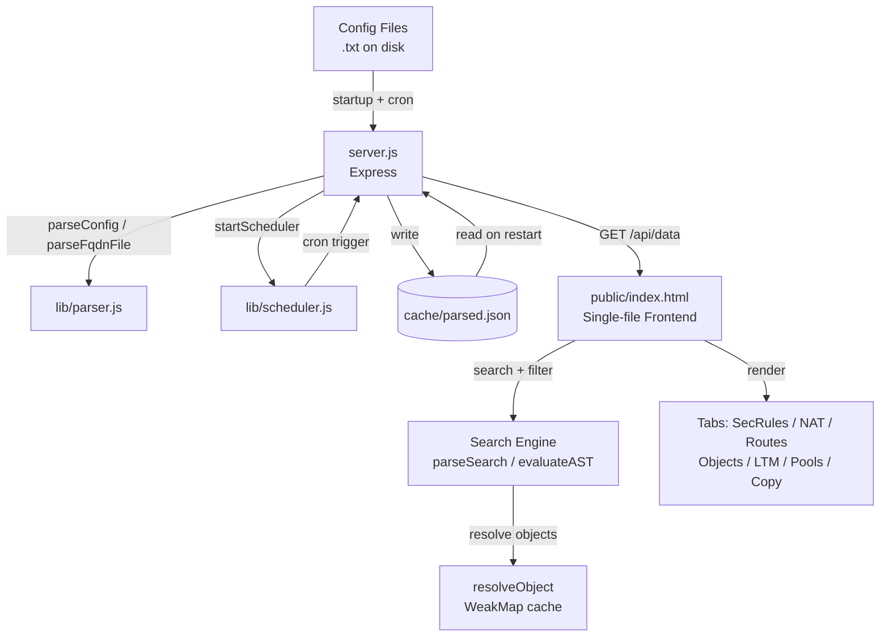
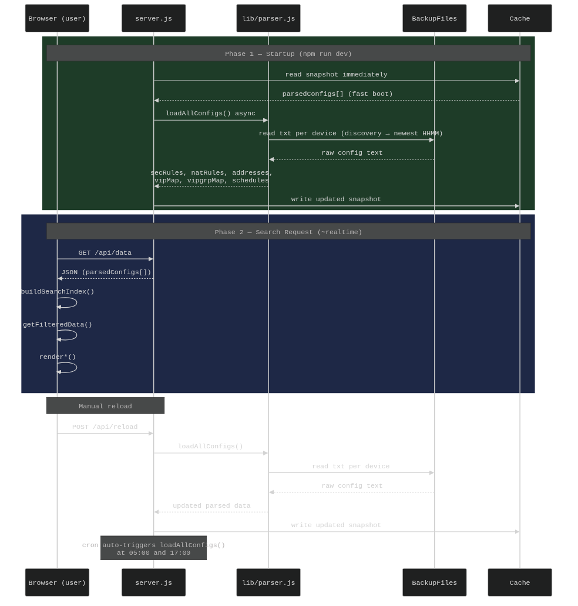

# NetSearch

A network configuration visualizer for firewall and load-balancer devices.  
Parse and search across FortiGate, Palo Alto, Juniper SRX, and F5 LTM configurations from a single browser interface.

---

## Features

- Multi-device support: FortiGate, Palo Alto, Juniper SRX, F5 LTM
- Full-text search with boolean operators (`AND`, `OR`, `NOT`)
- Filter by From Zone / To Zone / Tag / Source / Destination
- Security Rules, NAT Rules, Routes, Objects, LTM VS/Pools tabs
- Symmetric chaining — find related rules by shared IPs
- FQDN record lookup with IP chaining
- Disabled rule dimming, tag badges, resizable NAT columns
- Auto-reload via cron schedule (default: 05:00 and 17:00)
- Parsed data cached to disk; served instantly on restart
- Drag-and-drop config debug mode (browser-only, no server needed)

---

## Requirements

- Node.js 18+
- npm

---

## Installation

```bash
git clone https://github.com/ccclll1228/NetSearch_claude.git
cd NetSearch_claude
npm install
```

---

## Configuration

Copy the example config and edit paths to your local config files:

```bash
cp config/settings.example.json config/settings.json
```

`config/settings.json` (not committed — contains local paths):

```json
{
  "port": 3000,
  "configFiles": [
    { "path": "/path/to/FW01.txt", "type": "auto" },
    { "path": "/path/to/LTM01.txt", "type": "auto" }
  ],
  "fqdnFile": "/path/to/all_fqdn.csv",
  "cronSchedule": ["0 5 * * *", "0 17 * * *"]
}
```

| Field | Description |
|-------|-------------|
| `port` | HTTP port (default: 3000) |
| `configFiles[].path` | Absolute path to device config file |
| `configFiles[].type` | `"auto"` or explicit: `"fortigate"`, `"paloalto"`, `"srx"`, `"f5"` |
| `fqdnFile` | Path to CSV with columns: `fqdn,ip,owner,...` |
| `cronSchedule` | Array of cron expressions for auto-reload |

---

## Usage

```bash
# Production
npm start

# Development (auto-restart on file change)
npm run dev
```

Open **http://localhost:3000** in your browser.

### Manual reload via API

```bash
curl -X POST http://localhost:3000/api/reload
curl http://localhost:3000/api/status
```

### Search syntax

| Example | Meaning |
|---------|---------|
| `10.0.0.1` | Match any field containing this IP |
| `"exact-name"` | Exact match |
| `web AND untrust` | Both terms must match |
| `web OR mail` | Either term matches |
| `NOT disabled` | Exclude matches |
| `192.168.1.0/24` | CIDR range match |

---

## File Structure

```
NetSearch_sqlite/
├── server.js                  # Express server, in-memory state, API routes
├── ultradns.py                # Standalone UltraDNS → SQLite sync script
├── package.json
├── .gitignore
├── CLAUDE.md                  # AI coding guidance
├── ARCHITECTURE.md            # Sync pipeline flow diagram
├── lib/
│   ├── parser.js              # Config parsers (FortiGate, PaloAlto, SRX, F5)
│   ├── scheduler.js           # node-cron auto-reload scheduler
│   ├── discovery.js           # Resolves latest backup file per device
│   └── fqdn_db.js             # SQLite helper: search() + getLastSynced()
├── public/
│   └── index.html             # Single-file frontend (CSS + JS + HTML inline)
├── config/
│   ├── settings.json          # Local config (gitignored)
│   └── settings.example.json  # Template
├── db/
│   └── fqdn.db                # SQLite database (FQDN records from UltraDNS)
└── cache/
    └── parsed.json            # Auto-generated cache (gitignored)
```

---

## Architecture



### Request flow



| Phase | Description |
|-------|-------------|
| **Startup** | Server reads the disk cache immediately for a fast first response, then parses all device backup files in the background and writes an updated snapshot. |
| **Search request** | The browser fetches the full parsed dataset once, builds an in-memory search index, and runs `getFilteredData()` on every keystroke — no server round-trip per search. |
| **Reload** | A `POST /api/reload` (or the cron trigger at 05:00 / 17:00) re-parses all backup files and refreshes the disk cache without restarting the server. |

---

## API Endpoints

| Method | Path | Description |
|--------|------|-------------|
| `GET` | `/api/data` | All parsed configs + FQDN records |
| `GET` | `/api/status` | Load status + device list |
| `POST` | `/api/reload` | Trigger immediate config reload |
| `GET` | `/api/fqdn?q=<keyword>` | Search FQDN records in SQLite (`limit` param optional, max 1000) |

---

## UltraDNS Sync (`ultradns.py`)

Standalone Python script that pulls all DNS records from UltraDNS and writes them atomically to the local SQLite database (`db/fqdn.db`). No Flask or SQLAlchemy — uses only the Python standard library plus `requests`.

### Requirements

```bash
pip install requests
```

### Usage

```bash
export ULTRADNS_USERNAME="your-username"
export ULTRADNS_PASSWORD="your-password"
python3 ultradns.py
```

> **Read-only against UltraDNS.** The script issues GET requests only — no DNS records are created, modified, or deleted on UltraDNS. All writes go to the local SQLite database.

### Sync pipeline

```
ULTRADNS_USERNAME / ULTRADNS_PASSWORD (env vars)
        │
        ▼
POST /authorization/token  →  Bearer token
        │
        ▼
GET /v3/zones?limit=1000   →  cursor-based pagination  →  full zone list (~1,349 zones)
        │
        ▼
GET /zones/{zone}/rrsets?limit=500  (asyncio + ThreadPoolExecutor, 20 workers)
        │  offset-based pagination per zone
        ▼
Parse rrsets  →  profile (geo) records + standard records
        │
        ▼
SQLite  db/fqdn.db  →  BEGIN → DELETE FROM fqdn → INSERT all → COMMIT
```

### Supported record types

| Type | Code | Notes |
|------|------|-------|
| A | 1 | Multiple rdata joined with `,` |
| CNAME | 5 | Multiple rdata joined with `,` |
| MX | 15 | Multiple rdata joined with `,` |
| TXT | 16 | Skipped if joined value > 255 chars |
| SPF | 99 | Treated like TXT; skipped if > 255 chars |
| APEXALIAS | 65282 | Treated like CNAME |
| AAAA | 28 | Currently unhandled — logged and skipped |
| SRV | 33 | Currently unhandled — logged and skipped |
| NS | 2 | Silently skipped |
| SOA | 6 | Silently skipped |

Profile (geo/IP-pool) records are handled separately: each `rdataInfo` entry produces one row with its own `ttl`, `type`, and `geo_info`.

### Database

| Detail | Value |
|--------|-------|
| Path | `db/fqdn.db` (relative to script) |
| Table | `fqdn` |
| Columns | `id`, `fqdn`, `ip`, `owner`, `domain`, `type`, `ttl`, `geo_info`, `synced_at` |
| Indexes | `idx_fqdn`, `idx_ip`, `idx_geo` |
| `owner` | Always `"ultraDNS"` |
| `synced_at` | UTC ISO8601, same value for all rows in one run |

### Performance (approximate)

| Metric | Value |
|--------|-------|
| Zones | ~1,349 |
| Records written | ~7,880 |
| Concurrency | 20 workers |
| Total runtime | ~68 seconds |

---

## Supported Device Types

| Type | Detection | Key sections parsed |
|------|-----------|-------------------|
| FortiGate | `config firewall policy` | Policies, NAT, addresses, groups, routes |
| Palo Alto | `set security policies` | Security rules, NAT rules, address objects |
| Juniper SRX | `set security zones` | Security policies, SNAT/DNAT rule-sets |
| F5 LTM | `ltm virtual` | Virtual servers, pools, pool members |

---

## License

MIT
