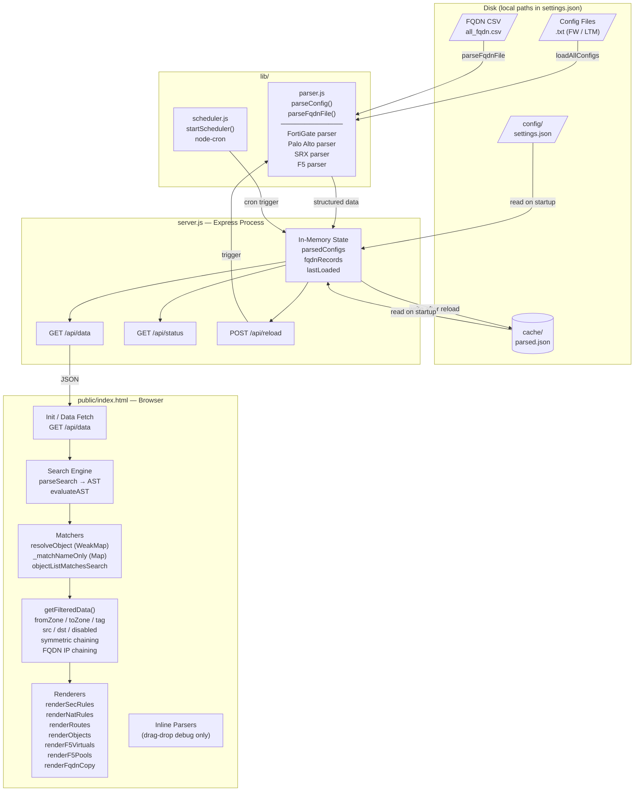
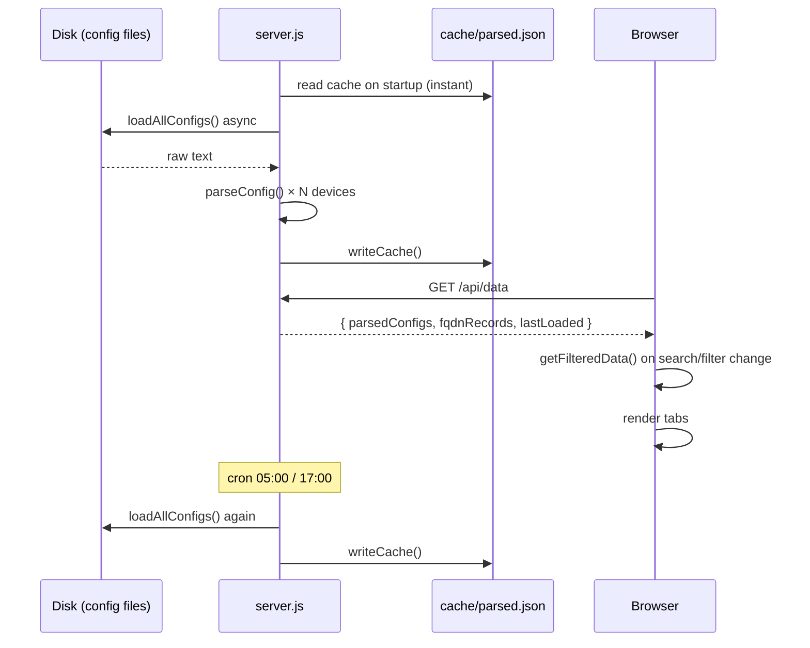
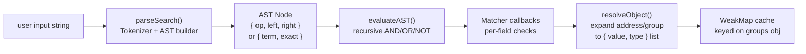

# NetSearch — Architecture

## Module Relationship Diagram



---

## Data Flow



---

## Parser Output Shape

All four parsers return the same normalized object:

```
{
  type:         string          // "FortiGate" | "PA" | "SRX" | "F5"
  hostname:     string
  addresses:    { name → string | string[] }
  groups:       { name → string[] }
  services:     { name → { protocol, port } }
  serviceGroups:{ name → string[] }
  secRules:     [{ name, disabled, action, from, to, source, destination,
                   application, service, category, tag }]
  natRules:     [{ name, disabled, from, to, source, destination,
                   service, tag, sourceTranslation, destinationTranslation }]
  routes:       [{ name, destination, nexthop, interface }]
  virtuals:     [{ name, ip, port, pool, ... }]   // F5 only
  pools:        [{ name, members }]               // F5 only
}
```

---

## Frontend Search Engine



---

## Symmetric Chaining & FQDN IP Matching

`getFilteredData()` builds two IP sets from matched rules for cross-tab chaining:

| Set | Cap | Used for |
|-----|-----|----------|
| `allRuleIps` | 50 entries | Routes, Addresses, Groups, F5 VS/Pools |
| `allRuleIpsForFqdn` | uncapped | FQDN tab only |

`allRuleIps` is capped to prevent O(N×M) freeze when iterating large rule/address sets.
`allRuleIpsForFqdn` is uncapped because FQDN matching is only IP-in-CIDR bitwise arithmetic —
CIDRs are pre-converted to `{num, mask}` pairs once before the FQDN record loop.

---

## Frontend DOM Patching Strategy

Pill expand/collapse avoids full `renderContent()` re-renders via targeted DOM patches:

| Operation | Method | Scope |
|-----------|--------|-------|
| Expand/Collapse All (sec/nat) | `_patchPillsChunked()` — rAF batches of 30 | All visible pills in tab |
| Expand/Collapse All (objects) | Direct `membersEl.innerHTML` replace | Object group rows |
| Single rule card expand/collapse | `_patchPidsDirect(pids)` — synchronous | Pills in that rule only |
| Individual nested node toggle | `_findRootPid()` → re-render root pill | One top-level pill |

Key internal maps (populated during `renderPills()`):

- `_pillContext` Map — pid → `{item, type, parsed, ctx}` — required for all DOM patches
- `_ruleExpandMap` — ruleKey → `{hostname, items, ctx}` — enumerate pills per rule card
- `_lastObjGroupMeta` — outerPid → `{g, addresses_dict, groups_dict}` — Objects fast-path
- `_patchGeneration` counter — incremented on every new patch or `renderContent(false)` to cancel stale rAF loops
